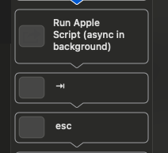

# Apple Scripts

Some util apple scripts. To run the files in a Mac install the AppleScript extension in VSCode and run the command:

```
AppleScript: Run Script (Option + Shift + R)
```


### Test
Imports needs to have the real path name so if using another username it needs to change

```applescript
property fontSize : load script POSIX file "/Users/leonardorick/.dotfiles/config/apple-scripts/one-note/change-font-size.scpt"
...
```

The test files should follow the standard -test.applescript suffix and they serve as a file that emulates how the actual apple script is going to run.

This files should only exist if the applescript is fore a specific set of applications, not a generic one.

### One Note

This is the best approach I found to run this script and to focus on the text again later


